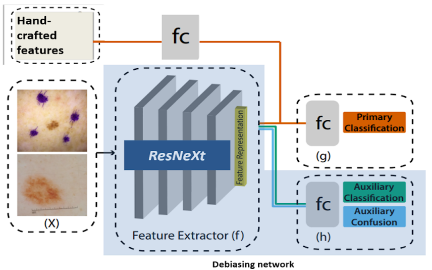
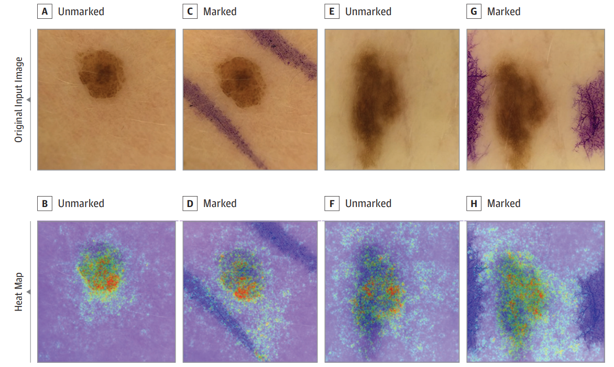

# Skin Cancer Detection with Domain Specific Artifact Debiasing and Augmentation

## Abstract
Early and accurate detection of melanoma is crucial for effective treatment. Deep learning techniques have shown promise in replicating melanoma diagnosis, but challenges like dataset imbalance and domain-specific artifacts hinder their performance. In this project, we propose augmentation techniques and hand-crafted feature incorporation to address these challenges. Our methods lead to significant improvements in model performance, with up to a 56% increase using unlearning methods and up to 24% increase compared to baseline models.

## Introduction
Melanoma, a form of skin cancer, requires early detection for effective treatment. Dermoscopy, a noninvasive imaging procedure, aids in diagnosis but is limited by its accuracy and cost. Deep learning models offer a promising solution, yet challenges like dataset imbalance and domain-specific artifacts affect their performance. This project aims to mitigate these challenges through augmentation techniques and hand-crafted feature incorporation.

  
## Proposed Method

### Dataset
We utilize dermoscopic skin lesion datasets from the ISIC challenge, pre-processing images for uniformity. To test model generalization, we evaluate on various datasets, including those with diverse ethnic representations.

### Artifact Debiasing
We employ a debiasing architecture called 'Turning a Blind Eye' (TABE) to remove bias induced by artifacts. TABE learns a feature representation invariant to secondary tasks, improving classification accuracy.

### Data Augmentation
We generate synthetic images with custom-designed artifacts to introduce randomness and alleviate dataset imbalance. This method enhances model generalization and prevents overfitting.

### Hand-crafted Features
Incorporating features based on the 'Asymmetry, Border, Color, and Diameter' (ABCD) metric, we capture lesion characteristics. Features like Hu moments and Local Binary Patterns aid in classification.

## Experimental Results
We evaluate model performance using AUC and F1 scores, demonstrating significant improvements with our proposed methods compared to baseline models.

**Table 1:** *AUC scores for the Model with different configurations.* The best performance for between the two debiasing techniques are highlighted in blue. Additionally, the best performance for the model configurations with handcrafted features is highlighted in red. All configurations were trained to converge to a minimum loss of 0.05

## Future Work
Future work includes extending the debiasing method to handle multiple artifacts simultaneously and improving computational efficiency for mobile deployment.

## Conclusion
Our proposed approach integrates augmentation, debiasing, and hand-crafted features to improve melanoma detection. By addressing dataset imbalance and artifact biases, we develop a robust model with enhanced performance, paving the way for more effective skin cancer diagnosis.
